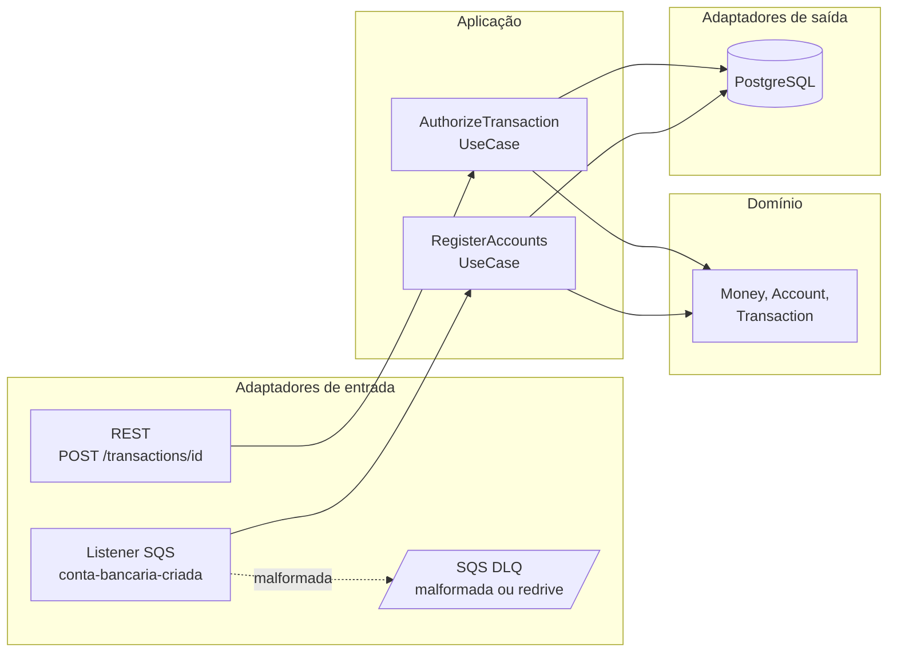
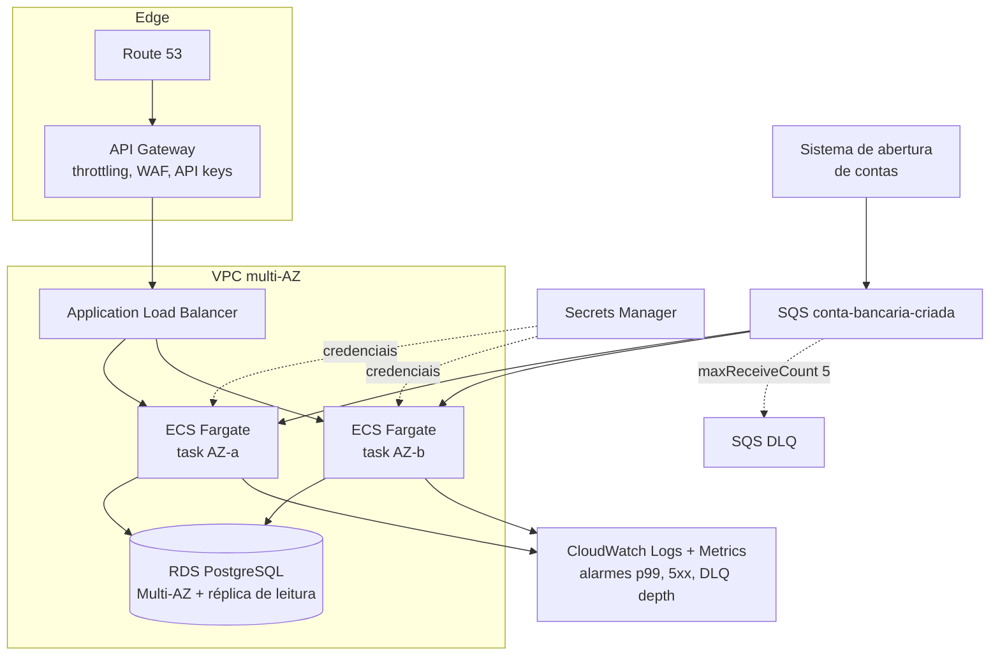
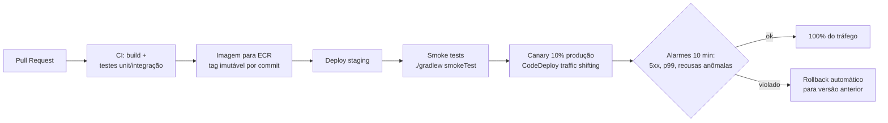

# Transaction Authorizer


API de autorização de transações financeiras (crédito e débito) com registro de contas
via fila SQS, construída para alta volumetria com foco em **consistência**, **disponibilidade**
e **resiliência**.

## Stack

| Camada | Escolha | Por quê |
|---|---|---|
| Linguagem | Kotlin (JDK 21) | Null-safety, imutabilidade natural para dinheiro/transações |
| Framework | Spring Boot 4 (WebMVC + virtual threads) | Maduro, observabilidade pronta, virtual threads dão alta concorrência sem stack reativo nem coroutines — o I/O dominante é JDBC bloqueante ([ADR-0006](docs/adr/0006-stack-spring-boot-4-jdbc-virtual-threads.md)) |
| Banco | PostgreSQL 17 | ACID; invariante de saldo garantida por UPDATE condicional atômico ([ADR-0001](docs/adr/0001-postgresql.md)) |
| Mensageria | AWS SQS (LocalStack local) | Definido pelo desafio ([ADR-0005](docs/adr/0005-consumo-sqs.md)) |
| Testes | Kotest, MockK, Testcontainers, Gatling | Pirâmide completa: unitário, integração, fumaça e carga |

## Arquitetura

Arquitetura hexagonal: domínio e casos de uso não conhecem HTTP, SQS nem SQL.



### Garantias centrais

- **Saldo nunca fica negativo e não há lost update**: débito é um único
  `UPDATE ... SET balance = balance - :v WHERE id = :id AND balance >= :v` atômico no banco.
  Nenhuma leitura prévia participa da decisão ([ADR-0002](docs/adr/0002-idempotencia-e-atomicidade.md)).
- **Idempotência por `transactionId`**: retentativas recebem exatamente a resposta original
  (header `X-Idempotent-Replay: true`) e o saldo é alterado uma única vez, mesmo com
  requisições concorrentes com o mesmo id.
- **Registro de contas idempotente**: redelivery da fila standard é inofensivo
  (`ON CONFLICT DO NOTHING`).
- **Nenhuma mensagem some**: a malformada é copiada para a DLQ e retirada do lote na
  primeira tentativa (reprocessá-la daria o mesmo erro para sempre); a válida que falha
  por infraestrutura volta para a fila e, após `maxReceiveCount`, é movida pelo redrive
  do próprio SQS ([ADR-0005](docs/adr/0005-consumo-sqs.md)).

Tudo isso é provado por testes de integração com concorrência real (50 débitos simultâneos,
corrida de idempotência, redelivery, os dois caminhos até a DLQ) e por um teste de caos que
derruba todas as conexões do banco e exige que o serviço volte sozinho, sem responder 500 no
caminho.

## Como executar

Pré-requisitos: Docker e JDK 21 (apenas para rodar testes/Gatling fora do container).
O JDK precisa ser o 21 mesmo: é a versão exigida pelo daemon do Gradle, e o download
automático de toolchain não cobre esse caso. Se o JDK padrão da máquina for outro, basta
ter um 21 instalado (o Gradle o encontra sozinho nos caminhos usuais); se ele estiver
fora do lugar, aponte com `JAVA_HOME=/caminho/do/jdk-21 ./gradlew ...` ou
`-Porg.gradle.java.installations.paths=/caminho/do/jdk-21`. As portas 8080, 5433 e 4566 precisam estar
livres, e a primeira subida baixa dependências Go dentro do gerador de contas, então
exige rede.

```bash
docker compose up --build
```

Sobe LocalStack (SQS), gerador de 100.000 contas do desafio, PostgreSQL e a aplicação
em `http://localhost:8080`. Aguarde `message-generator exited with code 0`; a aplicação
começa a consumir a fila imediatamente.

Para rodar a aplicação fora do Docker, ative o perfil `local`
(`SPRING_PROFILES_ACTIVE=local`): é ele que aponta o SQS para o LocalStack. Sem esse
perfil a aplicação assume ambiente de produção real (endpoint AWS e cadeia padrão de
credenciais, ex.: IAM role).

- Swagger UI: `http://localhost:8080/swagger-ui.html`
- Health: `http://localhost:8080/actuator/health`
- Métricas Prometheus: `http://localhost:8080/actuator/prometheus`
- Prometheus opcional: `docker compose --profile observability up` (`http://localhost:9090`)
- PostgreSQL exposto em `localhost:5433` (evita conflito com Postgres local em 5432)

Coleção de requisições em [`requests/transactions.http`](requests/transactions.http).

### API

`POST /transactions/{transactionId}`

```json
{
  "accountId": "5b19c8b6-0cc4-4c72-a989-0c2ee15fa975",
  "type": "CREDIT",
  "amount": { "value": 97.07, "currency": "BRL" }
}
```

Resposta (contrato do desafio):

```json
{
  "transaction": {
    "id": "8e8ae808-b154-48b5-9f3e-553935cc4543",
    "type": "CREDIT",
    "amount": { "value": 97.07, "currency": "BRL" },
    "status": "SUCCEEDED",
    "timestamp": "2025-07-08T15:57:55-03:00"
  },
  "account": {
    "id": "5b19c8b6-0cc4-4c72-a989-0c2ee15fa975",
    "balance": { "amount": 183.12, "currency": "BRL" }
  }
}
```

O valor de uma transação vai até `9999999999999.99` (13 dígitos inteiros). O limite
não é arbitrário: o contrato do desafio transporta o valor como **número JSON**, e
clientes que o desserializam em IEEE-754 double (JavaScript, Python) só fazem
round-trip exato até 15 dígitos significativos. Com um teto maior, mais de 80% dos
valores na faixa alta chegariam com o centavo alterado antes de qualquer validação,
sem erro visível. O saldo pode acumular além disso — a coluna é `NUMERIC(19,2)`, e um crédito que
levaria o saldo acima dessa faixa é recusado como resultado de negócio (422), não
como erro de servidor.
O campo também aceita o valor como string JSON (`"value": "97.07"`), forma que não
passa por `double` em cliente nenhum e preserva a precisão integralmente.

| Cenário | HTTP | Corpo |
|---|---|---|
| Aprovada | 200 | Envelope acima, `status: SUCCEEDED` |
| Recusada (saldo insuficiente, ou crédito acima do teto de saldo) | 422 | Envelope acima, `status: FAILED`, saldo intacto |
| Conta inexistente | 404 | Problem Details (RFC 9457) |
| Conta desabilitada / moeda não suportada | 422 | Problem Details |
| Mesmo `transactionId` com payload divergente | 409 | Problem Details (conflito de idempotência) |
| Capacidade esgotada (pool, timeout de consulta, espera por lock) | 503 | Problem Details com `Retry-After` |
| Falha no commit (resultado incerto) | 500 | Problem Details orientando reenvio com o **mesmo** `transactionId` |
| Payload inválido | 400 | Problem Details |

Racional do mapeamento em [ADR-0004](docs/adr/0004-mapeamento-http.md).

### Modelo de confiança

O contrato do desafio não carrega identidade do chamador, então **o serviço não autentica
ninguém e não verifica posse da conta**: quem chama decide o que acontece com qualquer
`accountId` que conheça. A conta guarda `owner_id`, que hoje é apenas persistido — não
existe com quem compará-lo. Isso é consequência do escopo, não descuido, mas vale
explicitar porque nenhum gateway resolve sozinho: throttling, WAF e API keys autenticam a
*aplicação* chamadora, não decidem se aquela chamada pode movimentar aquela conta.

Em produção, a identidade autenticada viria da borda (JWT ou mTLS) e a comparação com
`owner_id` seria feita aqui, no autorizador, porque é ele quem guarda o dado — essa
comparação é a finalidade da coluna, e é por isso que ela é persistida mesmo sem uso
hoje. Ela nunca sai em resposta HTTP nem em log. O `transactionId` é único no serviço
inteiro e não por conta — ver as consequências disso em
[ADR-0002](docs/adr/0002-idempotencia-e-atomicidade.md).

Dado pessoal fica restrito ao banco e à DLQ. Os logs carregam identificadores de
transação e de conta, nunca o do titular nem valores monetários; a mensagem de abertura
malformada é arquivada na DLQ com o motivo, e o log guarda só o motivo. A única exceção é
deliberada: se o arquivamento na DLQ falhar, o payload vai para o log, porque nesse ponto
ele é a última cópia da mensagem.

## Testes

```bash
./gradlew test              # unitários (Kotest + MockK, property-based incluso)
./gradlew integrationTest   # integração (Testcontainers: Postgres + LocalStack)
./gradlew smokeTest         # fumaça contra instância real (docker compose up antes)
./gradlew gatlingRun        # carga (docker compose up antes)
./gradlew detekt            # análise estática (roda também no check/CI)
./gradlew check             # test + integrationTest + detekt + koverVerify
```

`check` (e portanto `build`) inclui a suíte de integração, que sobe containers pelo
Testcontainers: o Docker precisa estar disponível, ainda que a stack do compose não
esteja no ar. Só `test` roda sem Docker.

- **Unitários**: domínio e aplicação puros, corner cases (débito exato zerando conta,
  escala > 2 casas, valor zero/negativo, corrida de idempotência, mensagem venenosa).
- **Integração**: as garantias de concorrência contra Postgres real; listener SQS fim a fim
  contra LocalStack real.
- **Fumaça**: caminho crítico de ponta a ponta em menos de um minuto, para gate de deploy.
- **Carga**: mix 2/3 débito e 1/3 crédito com seed pelo mesmo caminho de produção (fila).
  Assertions: falhas < 1%, p99 < 800 ms, média < 200 ms. Knobs: `LOAD_RATE`,
  `LOAD_DURATION_SECONDS`, `LOAD_ACCOUNTS`.

  Os números abaixo saem de um contêiner com 2 GiB de memória mas com acesso a todos
  os núcleos do host: em uma task Fargate com vCPU fracionário o paralelismo (e com
  ele o dimensionamento de threads de GC e de carriers das virtual threads) é menor,
  então servem como referência de ordem de grandeza, não como previsão de produção.

  Resultado de referência (notebook local, stack completa no docker compose, defaults
  da simulação): **42.672 requisições, 0 falhas, ~569 req/s, média 1 ms, p99 5 ms**.
  Após a carga, verificação de consistência no banco: para todas as contas,
  `saldo = SUM(créditos aprovados) - SUM(débitos aprovados)`, com **zero divergências
  e zero saldos negativos** em 42.672 transações gravadas — exatamente uma por
  requisição. A fila com as 100.000 contas do desafio foi drenada em paralelo à carga
  (100.500 contas no banco ao final, somando as 500 do seed da simulação).

  Elevando o rate até o serviço saturar (`LOAD_RATE=400 LOAD_DURATION_SECONDS=60
  ./gradlew gatlingRun`): **567.147 requisições, 0 falhas, ~7.462 req/s, média 3 ms,
  p99 38 ms**, com a mesma verificação de consistência intacta. A vazão e a contagem
  se reproduzem de forma estável; a latência de cauda depende do que mais estiver
  rodando na máquina (uma repetição com o host ocupado deu p99 de 68 ms). É o número citado no
  [ADR-0006](docs/adr/0006-stack-spring-boot-4-jdbc-virtual-threads.md) como evidência
  do modelo de threads.

### Cobertura de código (Kover)

| Suíte | Cobertura de linhas | O que exercita |
|---|---|---|
| Unitários | 62,8% | Domínio, aplicação e mapeamento de DTOs — isolados com MockK |
| Integração | 91,4% | Tudo acima + adaptadores reais: repositórios Postgres, controller, listener SQS |
| **Total (unit + integração)** | **97,5%** | Gate de 80% no build (`koverVerify`) |

A leitura correta dos números: na arquitetura hexagonal, adaptadores (SQL, HTTP,
fila) são deliberadamente testados contra infraestrutura real na camada de
integração, não com mocks na unitária. Por isso a suíte unitária cobre o núcleo de
negócio e a de integração completa os adaptadores. Medida apenas contra o que é
responsabilidade dela (domínio, aplicação, DTOs, listener SQS e os filtros web — o
mesmo escopo do Pitest, e o gate abaixo o lê de lá em vez de repetir a lista), a
suíte unitária cobre **97,2%**; os 62,8% acima incluem os repositórios JDBC e o
restante da camada web, que por decisão pertencem à integração. Fumaça e carga não medem
cobertura: a aplicação roda em container separado (JVM externa ao agente).

```bash
./gradlew koverHtmlReport                          # total (unit + integração)
./gradlew koverHtmlReport -PkoverMode=unit         # só unitários
./gradlew koverHtmlReport -PkoverMode=integration  # só integração
./gradlew koverVerify                              # falha se total < 80%
scripts/check-numbers.sh                           # confere os números deste README
```

Relatório em `build/reports/kover/html/index.html`. Excluídos da medição: classe de
bootstrap e pacote `config` (wiring sem lógica), source sets de teste.

**Todos os percentuais desta seção e dos badges são verificados no CI.** Eles já
divergiram da medição quatro vezes ao longo do projeto, sempre corrigidos à mão;
`scripts/check-numbers.sh` gera os relatórios e falha se o README prometer mais do que
eles sustentam — ou se ficar defasado depois de uma melhoria. O escopo do "núcleo" sai
do `targetClasses` do Pitest, não de uma lista repetida no script, que foi justamente
como esse número se desatualizou da última vez. Os números de carga ficam de fora: eles
dependem da máquina e não são reprodutíveis num runner compartilhado.

O que resta descoberto são caminhos inalcançáveis de propósito, não lacunas de
teste: o guard de moeda cruzada em `Money` e no replay de `AuthorizationService`
(com uma única moeda no enum não há como dispará-lo, ADR-0003, mesma razão de
parte dos sobreviventes de mutação abaixo), os métodos de I/O assíncrona dos wrappers de
stream dos filtros (`isReady`, `setReadListener`, `setWriteListener`), que a API
Servlet obriga a implementar e o MVC bloqueante nunca chama, e o fallback do
framework para path variable ausente por motivo diferente de conversão.

### Testes de mutação (Pitest)

Cobertura diz que uma linha foi executada; mutação diz se algum teste **falha quando o
comportamento muda**. O Pitest injeta defeitos artificiais (inverte condições, remove
chamadas, troca retornos) e verifica se a suíte unitária os detecta.

**Resultado:** pelo menos **90%** dos mutantes detectados, de 115 mutantes gerados,
zero sem cobertura. É um piso, não uma medição pontual: parte dos mutantes morre por
timeout, e um runner de CI com menos CPU detecta alguns a menos que uma máquina local
(90% contra 93% nas execuções recentes) sem que a suíte tenha piorado em nada. O gate do
build é esse mesmo 90% (`mutationThreshold`). Os sobreviventes são equivalentes
(mutação que não muda comportamento observável) ou os guards de moeda cruzada
inalcançáveis com um enum de uma moeda só.

```bash
./gradlew pitest   # relatório em build/reports/pitest/index.html
```

- Alvo: domínio, aplicação, DTOs, listener SQS e os filtros web — tudo que tem spec
  unitário. Repositórios JDBC, controller e handler de erro ficam fora por serem
  cobertos só por integração: mutantes lá seriam ruído que a suíte unitária não tem
  como matar.
- Filtrados da mutação: null-checks sintéticos do compilador Kotlin, chamadas de log e
  os métodos de I/O assíncrona da API Servlet (`isReady`, `isFinished`,
  `setReadListener`, `setWriteListener`), que são delegações puras nunca chamadas pelo
  MVC bloqueante.
- Sobreviventes conhecidos: o guard `requireSameCurrency` de `Money`, impossível de
  disparar com uma moeda só no enum (ADR-0003) — e note que ele protege a aritmética de
  `Money`, que o fluxo de autorização nem usa, já que o saldo é alterado por UPDATE no
  banco; multi-moeda exigiria uma verificação nova, não a reativação desta; e
  mutações equivalentes nos contadores de bytes dos filtros, que trocam o valor sem
  mudar nada observável.
- Ampliar o alvo aos filtros valeu a pena de imediato: expôs que
  `RequestSizeLimitFilter` criava um contador novo a cada `getInputStream()`, o que
  zerava a contagem e deixava passar corpo ilimitado lido em pedaços.

## Operação

O que olhar primeiro em cada sintoma. Escrito depois de exercitar os cenários contra a
stack real e anotar onde faltava informação.

| Sintoma | Onde olhar |
|---|---|
| 5xx subiu | O status separa a causa: **503** é saturação (pool cheio, timeout de query/lock) e sai como `WARN` com o recurso; **500** é defeito e sai como `ERROR` com stack trace e recurso. `hikaricp_connections_pending` confirma saturação de pool. |
| "Minha transação sumiu" | Se foi avaliada, há uma linha em `transactions` e o log `Autorização concluída transactionId=...`. Se não foi, a recusa aparece em `authorizer_requests_rejected_total{reason}` e no log `Requisição recusada reason=... recurso=...` — 404, 409 e conta desabilitada não gravam no banco, e é esse par que conta a história. |
| Pico de 422 | `authorizer_requests_rejected_total{reason="account-disabled"}` separa conta bloqueada de recusa por saldo, que é `authorizer_transactions_total{status="FAILED"}`. Os dois respondem 422 e sem a tag seriam o mesmo alarme. |
| Fila crescendo | `/actuator/health/sqs` responde só pelo consumo: DOWN quer dizer que o listener parou. Se estiver UP e a fila crescendo, é lentidão, não morte — lag aproximado por `SELECT now() - max(registered_at) FROM accounts`. |
| Mensagens na DLQ | O atributo `x-authorizer-motivo` distingue as duas origens: se **existe**, a mensagem é malformada e foi arquivada pela aplicação (o valor é o erro de parse); se **não existe**, chegou por redrive do SQS após `maxReceiveCount` falhas de infraestrutura, e `ApproximateReceiveCount` confirma. |
| Saldo suspeito | `transactions.balance_after` é imutável: reconcilie com `SELECT balance, SUM(CASE WHEN type='CREDIT' AND status='SUCCEEDED' THEN amount WHEN type='DEBIT' AND status='SUCCEEDED' THEN -amount ELSE 0 END) ...` agrupando por conta. |
| Latência piorou | `http_server_requests_seconds` tem histograma de percentis por rota e status. Compare com `hikaricp_connections_acquire_seconds` (pool) e `jvm_gc_pause_seconds` (GC) para atribuir a causa. |

O indicador `sqsListener` reporta DOWN se algum container de escuta parar, ou se nenhum
tiver sido registrado — antes disso, um listener morto deixava o serviço verde e o único
indício era uma métrica parar de crescer. Como `show-details` esconde o detalhe por
componente de chamador anônimo (e sem Spring Security ninguém é autorizado), ele ganhou um
grupo próprio: **`/actuator/health/sqs`** responde só pelo consumo da fila, com status
próprio e sem revelar detalhe de infraestrutura. É esse o endpoint para alarmar.

O indicador fica **fora** do grupo `readiness` de propósito: autorizar transações não
depende da fila, e tirar a instância do balanceador porque o consumo parou trocaria
degradação parcial por indisponibilidade total. O sinal serve para alarme, não para
roteamento.

**Limitação conhecida**: não há métrica de lag da fila (idade da mensagem mais antiga). O
proxy é a consulta de `registered_at` acima; em produção viria do próprio SQS via
CloudWatch.

## Decisões de arquitetura (ADRs)

| ADR | Decisão |
|---|---|
| [0001](docs/adr/0001-postgresql.md) | PostgreSQL, e por que não DynamoDB/MongoDB |
| [0002](docs/adr/0002-idempotencia-e-atomicidade.md) | UPDATE condicional + PK de transactions como mecanismo de consistência |
| [0003](docs/adr/0003-somente-brl.md) | Somente BRL nesta versão |
| [0004](docs/adr/0004-mapeamento-http.md) | 422 para recusa com envelope completo |
| [0005](docs/adr/0005-consumo-sqs.md) | Consumo em lote, ack ON_SUCCESS, DLQ pelos dois caminhos |
| [0006](docs/adr/0006-stack-spring-boot-4-jdbc-virtual-threads.md) | Spring Boot 4, JdbcClient sem JPA, MVC + virtual threads (e por que não coroutines/WebFlux) |

## Deploy em cloud pública (proposta)



- **Compute**: ECS Fargate com auto scaling por CPU e por requisições por target;
  mínimo de 2 tasks em AZs distintas.
- **Banco**: RDS PostgreSQL Multi-AZ; failover automático. Escala de leitura via réplica;
  escala de escrita via particionamento por `account_id` (a chave natural de partição,
  pois toda operação é por conta) quando o volume exigir.
- **Fila**: SQS com DLQ (`maxReceiveCount: 5`) e alarme de profundidade.
- **Resiliência**: retries com backoff exponencial e full jitter no SDK (já configurado),
  graceful shutdown, health checks de liveness/readiness no ALB e no ECS.

## Pipeline de deploy (proposta)



O canário limita o raio de explosão de um bug a ~10% dos clientes por alguns minutos;
o rollback é automático ao disparar alarme. Migrações de banco seguem a regra
expand/contract (nunca quebrar a versão N-1, que continua rodando durante o shift).

## O que faria com mais tempo

- **Extrato bancário** (`GET /accounts/{id}/transactions`): o índice
  `(account_id, created_at DESC)` já existe para suportá-lo.
- **Circuit breaker** (resilience4j) na borda HTTP para degradar rápido se o banco
  estiver indisponível, e **rate limiting** por conta.
- **Outbox pattern** para publicar eventos `transaction-authorized` sem dual-write.
- **Particionamento** da tabela `accounts` por hash de `account_id` para escala de escrita
  horizontal (Citus ou particionamento nativo).
- **Retenção de `transactions`**: a tabela cresce indefinidamente (cada autorização é uma
  linha imutável). Em produção: particionamento por tempo (`created_at`) com desanexação
  de partições antigas para storage frio (S3/Parquet), mantendo online a janela exigida
  pelo extrato e pela auditoria. O replay idempotente só precisa da janela de retentativa
  dos clientes (dias, não anos).
- **Testes de caos** (falha de banco no meio da autorização) e **testes de contrato**
  (Pact) para os consumidores da API.
- **Teto de saldo por conta**: hoje o único teto é o da faixa suportada (`NUMERIC(19,2)`,
  ~10^17), e o crédito que o excederia é recusado como resultado de negócio (422, saldo
  intacto). Em produção o limite seria por conta e por política de produto, não pelo tipo
  da coluna, e viria com um código de recusa próprio no envelope.
