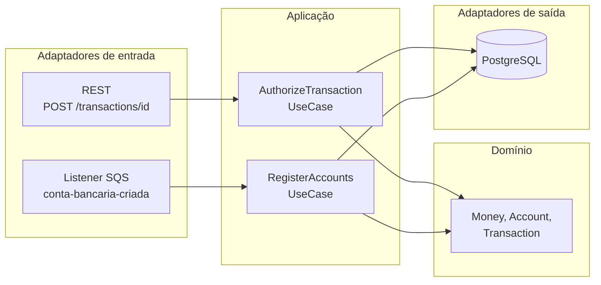
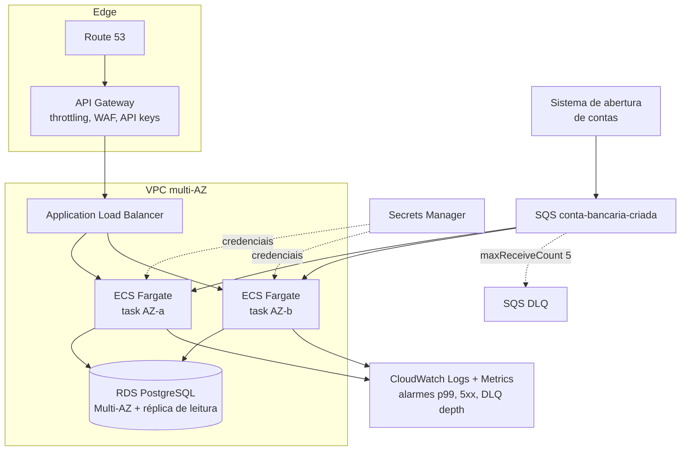
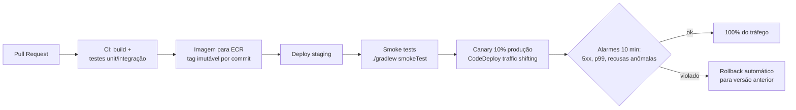

# Transaction Authorizer


API de autorização de transações financeiras (crédito e débito) com registro de contas
via fila SQS, construída para alta volumetria com foco em **consistência**, **disponibilidade**
e **resiliência**.

## Stack

| Camada | Escolha | Por quê |
|---|---|---|
| Linguagem | Kotlin (JDK 21) | Null-safety, imutabilidade natural para dinheiro/transações |
| Framework | Spring Boot 4 (WebMVC + virtual threads) | Maduro, observabilidade pronta, virtual threads dão alta concorrência sem stack reativo ([ADR-0006](docs/adr/0006-stack-spring-boot-4-jdbc-virtual-threads.md)) |
| Banco | PostgreSQL 17 | ACID; invariante de saldo garantida por UPDATE condicional atômico ([ADR-0001](docs/adr/0001-postgresql.md)) |
| Mensageria | AWS SQS (LocalStack local) | Definido pelo desafio ([ADR-0005](docs/adr/0005-consumo-sqs.md)) |
| Testes | Kotest, MockK, Testcontainers, Gatling | Pirâmide completa: unitário, integração, fumaça e carga |

## Arquitetura

Arquitetura hexagonal: domínio e casos de uso não conhecem HTTP, SQS nem SQL.



### Garantias centrais

- **Saldo nunca fica negativo e não há lost update**: débito é um único
  `UPDATE ... SET balance = balance - :v WHERE id = :id AND balance >= :v` atômico no banco.
  Nenhuma leitura prévia participa da decisão ([ADR-0002](docs/adr/0002-idempotencia-e-atomicidade.md)).
- **Idempotência por `transactionId`**: retentativas recebem exatamente a resposta original
  (header `X-Idempotent-Replay: true`) e o saldo é alterado uma única vez, mesmo com
  requisições concorrentes com o mesmo id.
- **Registro de contas idempotente**: redelivery da fila standard é inofensivo
  (`ON CONFLICT DO NOTHING`).

Tudo isso é provado por testes de integração com concorrência real
(50 débitos simultâneos, corrida de idempotência, redelivery).

## Como executar

Pré-requisitos: Docker e JDK 21 (apenas para rodar testes/Gatling fora do container).

```bash
docker compose up --build
```

Sobe LocalStack (SQS), gerador de 100.000 contas do desafio, PostgreSQL e a aplicação
em `http://localhost:8080`. Aguarde `message-generator exited with code 0`; a aplicação
começa a consumir a fila imediatamente.

Para rodar a aplicação fora do Docker, ative o perfil `local`
(`SPRING_PROFILES_ACTIVE=local`): é ele que aponta o SQS para o LocalStack. Sem esse
perfil a aplicação assume ambiente de produção real (endpoint AWS e cadeia padrão de
credenciais, ex.: IAM role).

- Swagger UI: `http://localhost:8080/swagger-ui.html`
- Health: `http://localhost:8080/actuator/health`
- Métricas Prometheus: `http://localhost:8080/actuator/prometheus`
- Prometheus opcional: `docker compose --profile observability up` (`http://localhost:9090`)
- PostgreSQL exposto em `localhost:5433` (evita conflito com Postgres local em 5432)

Coleção de requisições em [`requests/transactions.http`](requests/transactions.http).

### API

`POST /transactions/{transactionId}`

```json
{
  "accountId": "5b19c8b6-0cc4-4c72-a989-0c2ee15fa975",
  "type": "CREDIT",
  "amount": { "value": 97.07, "currency": "BRL" }
}
```

Resposta (contrato do desafio):

```json
{
  "transaction": {
    "id": "8e8ae808-b154-48b5-9f3e-553935cc4543",
    "type": "CREDIT",
    "amount": { "value": 97.07, "currency": "BRL" },
    "status": "SUCCEEDED",
    "timestamp": "2025-07-08T15:57:55-03:00"
  },
  "account": {
    "id": "5b19c8b6-0cc4-4c72-a989-0c2ee15fa975",
    "balance": { "amount": 183.12, "currency": "BRL" }
  }
}
```

O valor de uma transação vai até `9999999999999.99` (13 dígitos inteiros). O limite
não é arbitrário: o contrato do desafio transporta o valor como **número JSON**, e
clientes que o desserializam em IEEE-754 double (JavaScript, Python) só fazem
round-trip exato até 15 dígitos significativos. Com um teto maior, mais de 80% dos
valores na faixa alta chegariam com o centavo alterado antes de qualquer validação,
sem erro visível. O saldo pode acumular além disso — a coluna é `NUMERIC(19,2)`.
O campo também aceita o valor como string JSON (`"value": "97.07"`), forma que não
passa por `double` em cliente nenhum e preserva a precisão integralmente.

| Cenário | HTTP | Corpo |
|---|---|---|
| Aprovada | 200 | Envelope acima, `status: SUCCEEDED` |
| Recusada (saldo insuficiente) | 422 | Envelope acima, `status: FAILED`, saldo intacto |
| Conta inexistente | 404 | Problem Details (RFC 9457) |
| Conta desabilitada / moeda não suportada | 422 | Problem Details |
| Mesmo `transactionId` com payload divergente | 409 | Problem Details (conflito de idempotência) |
| Payload inválido | 400 | Problem Details |

Racional do mapeamento em [ADR-0004](docs/adr/0004-mapeamento-http.md).

## Testes

```bash
./gradlew test              # unitários (Kotest + MockK, property-based incluso)
./gradlew integrationTest   # integração (Testcontainers: Postgres + LocalStack)
./gradlew smokeTest         # fumaça contra instância real (docker compose up antes)
./gradlew gatlingRun        # carga (docker compose up antes)
./gradlew detekt            # análise estática (roda também no check/CI)
```

- **Unitários**: domínio e aplicação puros, corner cases (débito exato zerando conta,
  escala > 2 casas, valor zero/negativo, corrida de idempotência, mensagem venenosa).
- **Integração**: as garantias de concorrência contra Postgres real; listener SQS fim a fim
  contra LocalStack real.
- **Fumaça**: caminho crítico de ponta a ponta em menos de um minuto, para gate de deploy.
- **Carga**: mix 2/3 débito e 1/3 crédito com seed pelo mesmo caminho de produção (fila).
  Assertions: falhas < 1%, p99 < 800 ms, média < 200 ms. Knobs: `LOAD_RATE`,
  `LOAD_DURATION_SECONDS`, `LOAD_ACCOUNTS`.

  Resultado de referência (notebook local, stack completa no docker compose):
  **42.672 requisições, 0 falhas, ~569 req/s, média 1 ms, p99 2 ms**. Após a carga,
  verificação de consistência no banco: para todas as contas,
  `saldo = SUM(créditos aprovados) - SUM(débitos aprovados)`, com **zero divergências
  e zero saldos negativos** em 42.678 transações gravadas. A fila com 100.000 contas
  do desafio (200.000 no teste, gerador executado duas vezes) foi drenada integralmente.

### Cobertura de código (Kover)

| Suíte | Cobertura de linhas | O que exercita |
|---|---|---|
| Unitários | 61,8% | Domínio, aplicação e mapeamento de DTOs — isolados com MockK |
| Integração | 96,5% | Tudo acima + adaptadores reais: repositórios Postgres, controller, listener SQS |
| **Total (unit + integração)** | **99,7%** | Gate de 80% no build (`koverVerify`) |

A leitura correta dos números: na arquitetura hexagonal, adaptadores (SQL, HTTP,
fila) são deliberadamente testados contra infraestrutura real na camada de
integração, não com mocks na unitária. Por isso a suíte unitária cobre o núcleo de
negócio e a de integração completa os adaptadores. Medida apenas contra os pacotes
que são responsabilidade dela (domínio, aplicação, DTOs e listener — o mesmo escopo
do Pitest), a suíte unitária cobre **99,4%**; os 61,8% acima incluem os adaptadores
JDBC e web, que por decisão pertencem à integração. Fumaça e carga não medem
cobertura: a aplicação roda em container separado (JVM externa ao agente).

```bash
./gradlew koverHtmlReport                          # total (unit + integração)
./gradlew koverHtmlReport -PkoverMode=unit         # só unitários
./gradlew koverHtmlReport -PkoverMode=integration  # só integração
./gradlew koverVerify                              # falha se total < 80%
```

Relatório em `build/reports/kover/html/index.html`. Excluídos da medição: classe de
bootstrap e pacote `config` (wiring sem lógica), source sets de teste.

O 0,3% restante (1 linha, 3 branches) é o guard de moeda cruzada em `Money` e no
replay de `AuthorizationService`: com uma única moeda no enum (ADR-0003) é
impossível construir o caso que o dispara. Fica como proteção para a evolução
multi-moeda, mesma razão dos 2 sobreviventes de mutação abaixo.

### Testes de mutação (Pitest)

Cobertura diz que uma linha foi executada; mutação diz se algum teste **falha quando o
comportamento muda**. O Pitest injeta defeitos artificiais (inverte condições, remove
chamadas, troca retornos) e verifica se a suíte unitária os detecta.

**Resultado: 62 de 64 mutantes mortos (96,9%), zero mutantes sem cobertura.**
Gate de 90% no build (`mutationThreshold`).

```bash
./gradlew pitest   # relatório em build/reports/pitest/index.html
```

- Alvo: domínio, aplicação e adaptadores com testes unitários. Adaptadores cobertos por
  integração (SQL/controller) ficam fora: mutantes lá seriam ruído que a suíte unitária
  não tem como matar.
- Filtrados da mutação: null-checks sintéticos do compilador Kotlin e chamadas de log
  (não são comportamento de negócio).
- Os 2 sobreviventes conhecidos são o guard `requireSameCurrency` de `Money`: com uma
  única moeda no enum (ADR-0003) é impossível construir o caso que o dispara. O guard
  fica como proteção para a evolução multi-moeda.

## Decisões de arquitetura (ADRs)

| ADR | Decisão |
|---|---|
| [0001](docs/adr/0001-postgresql.md) | PostgreSQL, e por que não DynamoDB/MongoDB |
| [0002](docs/adr/0002-idempotencia-e-atomicidade.md) | UPDATE condicional + PK de transactions como mecanismo de consistência |
| [0003](docs/adr/0003-somente-brl.md) | Somente BRL nesta versão |
| [0004](docs/adr/0004-mapeamento-http.md) | 422 para recusa com envelope completo |
| [0005](docs/adr/0005-consumo-sqs.md) | Consumo em lote, ack ON_SUCCESS, DLQ em produção |
| [0006](docs/adr/0006-stack-spring-boot-4-jdbc-virtual-threads.md) | Spring Boot 4, JdbcClient sem JPA, MVC + virtual threads |

## Deploy em cloud pública (proposta)



- **Compute**: ECS Fargate com auto scaling por CPU e por requisições por target;
  mínimo de 2 tasks em AZs distintas.
- **Banco**: RDS PostgreSQL Multi-AZ; failover automático. Escala de leitura via réplica;
  escala de escrita via particionamento por `account_id` (a chave natural de partição,
  pois toda operação é por conta) quando o volume exigir.
- **Fila**: SQS com DLQ (`maxReceiveCount: 5`) e alarme de profundidade.
- **Resiliência**: retries com backoff exponencial e full jitter no SDK (já configurado),
  graceful shutdown, health checks de liveness/readiness no ALB e no ECS.

## Pipeline de deploy (proposta)



O canário limita o raio de explosão de um bug a ~10% dos clientes por alguns minutos;
o rollback é automático ao disparar alarme. Migrações de banco seguem a regra
expand/contract (nunca quebrar a versão N-1, que continua rodando durante o shift).

## O que faria com mais tempo

- **Extrato bancário** (`GET /accounts/{id}/transactions`): o índice
  `(account_id, created_at DESC)` já existe para suportá-lo.
- **Circuit breaker** (resilience4j) na borda HTTP para degradar rápido se o banco
  estiver indisponível, e **rate limiting** por conta.
- **Outbox pattern** para publicar eventos `transaction-authorized` sem dual-write.
- **Particionamento** da tabela `accounts` por hash de `account_id` para escala de escrita
  horizontal (Citus ou particionamento nativo).
- **Retenção de `transactions`**: a tabela cresce indefinidamente (cada autorização é uma
  linha imutável). Em produção: particionamento por tempo (`created_at`) com desanexação
  de partições antigas para storage frio (S3/Parquet), mantendo online a janela exigida
  pelo extrato e pela auditoria. O replay idempotente só precisa da janela de retentativa
  dos clientes (dias, não anos).
- **Testes de caos** (falha de banco no meio da autorização) e **testes de contrato**
  (Pact) para os consumidores da API.
- **Teto de saldo explícito**: `NUMERIC(19,2)` comporta saldo até ~10^17. Um crédito
  válido que estourasse esse teto hoje responderia 500 (e, como nada é gravado, o retry
  repetiria o erro). Cenário exige saldo de centenas de quatrilhões de reais, mas a
  versão de produção teria teto de saldo por conta com recusa de negócio explícita em
  vez de erro genérico.
